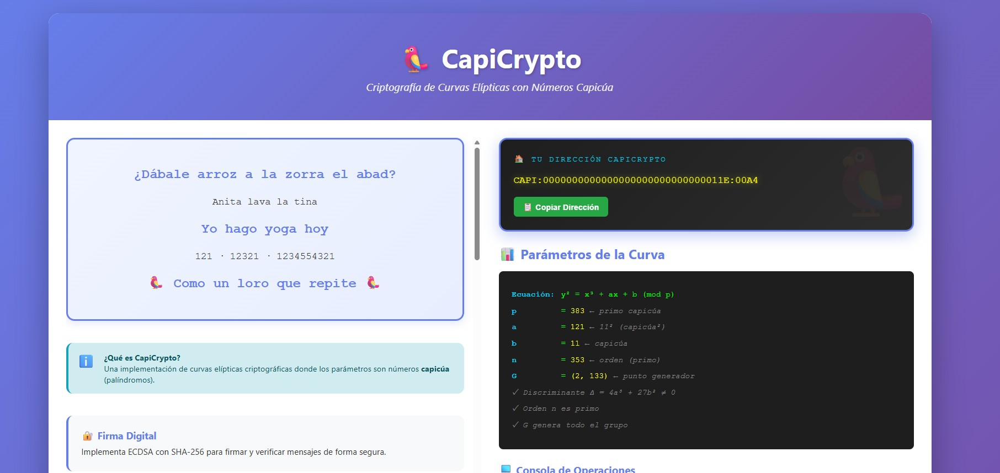
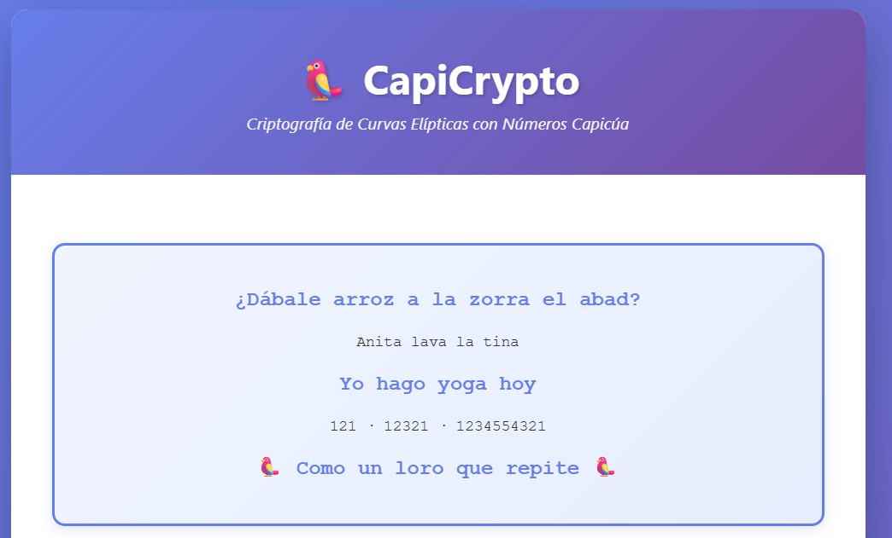

# 🦜 CapiCrypto

> **Criptografía de Curvas Elípticas con Números Capicúa**  
> _Como un loro que repite: los números se leen igual del derecho y al revés_

[](https://opensource.org/licenses/MIT)
[](https://nodejs.org/)
[]()



---

## 🎯 ¿Qué es CapiCrypto?

**CapiCrypto** es una implementación educativa de **curvas elípticas criptográficas** donde los parámetros son **números capicúa** (palíndromos): números que se leen igual al derecho que al revés.

### ¿Por qué un loro? 🦜

¡Porque los loros repiten! Y los capicúas son como palabras que se repiten al revés:
- **1331** ← se lee igual en ambas direcciones
- **12321** ← ¡capicúa!
- **1234554321** ← ¡capicúa más grande!

---

## 🔐 Concepto Matemático

Una **curva elíptica de Weierstrass** tiene la forma:

```
y² = x³ + ax + b  (mod p)
```

En **CapiCrypto**, los parámetros `a` y `b` son números capicúa:

```javascript
a = 12345678987654321  // ← ¡se lee igual al revés!
b = 98765432123456789  // ← ¡capicúa también!
```

### 🪞 La Magia Multiplicadora de los Capicúas

¡Como un loro que se mira al espejo y se multiplica por sí mismo! Algunos números capicúa tienen una propiedad especial:

**Cuando los multiplicas, ¡generan nuevos capicúas!**

```javascript
// 🦜 NIVEL 1: Capicúa base
11 × 11 = 121           // ← ¡11² es capicúa!

// 🦜 NIVEL 2: Capicúa de capicúa
121 × 121 = 14641       // ← ¡121² también es capicúa!

// 🦜 NIVEL 3: El reflejo continúa...
111 × 111 = 12321       // ← ¡111² es capicúa!
1111 × 1111 = 1234321   // ← ¡El patrón se mantiene!

// 🦜 EJEMPLOS EN CAPICRYPTO:
// Base capicúa
base_a = 11             // capicúa

// Cuadrado capicúa (el loro se multiplica)
a = 11² = 121          // ← ¡capicúa²! 🎯
```

**Esta propiedad hace que nuestros parámetros sean doblemente especiales:**
1. Son capicúa por sí mismos (11, 121)
2. Son el resultado de multiplicar capicúas por sí mismos (11 × 11)

Como un loro que repite su reflejo infinitamente... 🦜🪞🦜

### 📊 Fundamento Teórico: "Casi Todos los Palíndromos son Compuestos"

**Paper de Referencia**: ["Almost All Palindromes Are Composite"](https://www.jstor.org/stable/4145070) de William D. Banks (2004)

**Hallazgo Principal del Paper**: 
> **"Casi todos los números capicúa son compuestos (no primos)"**

Banks demuestra matemáticamente que:
- 📉 La densidad de primos palindrómicos tiende a **cero** conforme los números crecen
- 🔢 La mayoría abrumadora de capicúas son números **compuestos** (tienen factores)
- ⚠️ Encontrar un capicúa que sea primo es cada vez más **excepcional**

**¿Y los pocos que SÍ son primos?**

Aunque raros, existen capicúas primos (como nuestro `p = 383`). Sin embargo:

```javascript
// ✅ CAPICÚA PRIMO (raro, pero existe)
p = 383    // primo Y capicúa - necesario para criptografía
n = 353    // primo Y capicúa - necesario para el orden

// ❌ CAPICÚA COMPUESTO (la mayoría según Banks)
121 = 11 × 11    // capicúa pero compuesto - NO sirve como p o n
1221 = 3 × 11 × 37    // capicúa pero compuesto
```

**¿Qué significa esto para CapiCrypto?**

- 🎯 **Desafío Aumentado**: Buscar capicúas primos es como "buscar agujas en un pajar"
- 🔐 **Necesidad Criptográfica**: Solo podemos usar los **raros** capicúas que son primos
- ⚠️ **NO mejora seguridad**: El paper explica por qué es difícil, no nos da ventaja
- 🎓 **Valor Educativo**: Demuestra la tensión entre estructura (simetría) y primalidad

**Conclusión**: Los capicúas son fascinantes matemáticamente, pero la mayoría son compuestos. Los pocos que son primos son excepcionales y difíciles de encontrar. Esta propiedad es **estética y educativa**, no criptográficamente ventajosa. Para seguridad real, usar curvas estándar auditadas.

### Características

- ✅ **Curva válida**: Discriminante Δ = 4a³ + 27b² ≠ 0
- ✅ **Punto generador G** verificado en la curva
- ✅ **ECDSA signatures** con SHA-256
- ✅ **Basado en @noble/curves** (librería auditada)
- ✅ **Formato de dirección propio**: `CAPI:...` único e identificable
- ✅ **Generación aleatoria de claves** con función exportada
- 🎓 **Propósito educativo**: Aprender cómo funcionan las curvas elípticas

---

## 📦 Instalación

```bash
git clone https://github.com/tu-usuario/capicrypto.git
cd capicrypto
npm install
```

---

## 🚀 Uso Rápido

### 1. Generar claves y ver la curva

```bash
npm start
```

Esto generará:
- 🔑 Par de claves (privada/pública)
- 📊 Parámetros de la curva capicúa
- 🏠 **Dirección CapiCrypto** (formato `CAPI:...`)
- ✅ Verificación de que los puntos están en la curva

### 2. Firmar y verificar mensajes

```bash
npm run sign
```

Demuestra:
- ✍️ Firma ECDSA de un mensaje
- 🔍 Verificación de la firma
- ❌ Detección de mensajes alterados
- 🔒 Detección de claves incorrectas

### 3. Interfaz Web Interactiva 🌐

```bash
npm run web
```

Abre una interfaz web bonita donde puedes:
- 🎲 Generar claves aleatorias
- ✍️ Firmar mensajes
- 🔍 Verificar firmas
- 📊 Ver información técnica
- 🦜 ¡Todo con estilo capicúa!

### 4. Ejecutar todo

```bash
npm run all
```

---

## 📐 Parámetros de la Curva

### Versión Actual (Educativa) - p=383

Para fines demostrativos, usamos una curva más pequeña donde podemos calcular el orden `n` rápidamente.

**¡Con parámetros capicúa encontrados por nuestro buscador!**

```javascript
// 🦜 PARÁMETROS CAPICÚA EDUCATIVOS
p = 383              // ← ¡primo capicúa!
n = 353              // ← orden (también primo)
h = 1                // ← cofactor

// 🪞 La magia multiplicadora
base_a = 11          // capicúa base
base_b = 11          // capicúa base

a = 11 × 11 = 121   // ← ¡capicúa²! El loro se multiplica
b = 11              // ← capicúa

G = (2, 133)        // ← punto generador verificado
```

**Propiedades verificadas:**
- ✅ `p = 383` es primo Y capicúa
- ✅ `n = 353` es primo (orden del grupo)
- ✅ `a = 121` es capicúa² (11 × 11)
- ✅ `b = 11` es capicúa
- ✅ Discriminante: Δ = 4(121³) + 27(11²) ≠ 0
- ✅ Teorema de Hasse: |353 - 384| = 31 ≤ 2√383 ≈ 39.19

### 🏠 Formato de Dirección CapiCrypto

Las claves públicas se presentan en un formato único:

```
CAPI:239A11504A21F344B93C6D9EF184B2A9:ABCD
 ↑    ↑                                ↑
 │    │                                └─ Checksum (4 chars)
 │    └─────────────────────────────────── Dirección (32 chars)
 └──────────────────────────────────────── Prefijo CapiCrypto
```

**Características:**
- 🦜 Formato nativo (no confundir con Ethereum)
- ✨ Derivado de las coordenadas (X, Y) de la clave pública
- 🔒 Checksum para validación visual
- 📱 Compatible con QR codes

### ⚠️ Limitación: Curvas de 256 bits

Para una curva de 256 bits (nivel de seguridad real), necesitamos calcular el orden `n` con el algoritmo de Schoof:

**Problema**: JavaScript puro NO es adecuado para este cálculo.

- Complejidad: O(log⁸ p) para Schoof
- Para p ≈ 2^256: días o semanas de cómputo
- Se requiere C++/Rust con MIRACL o SageMath

📖 **[Lee la explicación completa aquí: El Desafío de 256 Bits](docs/256-bit-challenge.md)**

Por eso optamos por la curva educativa p=383 donde el orden se puede calcular en < 1 segundo.

---

## 🎓 ¿Qué es el Orden `n`?

El orden `n` es el número de veces que necesitas sumar el punto generador `G` a sí mismo para llegar al **punto en el infinito** (elemento identidad):

```
n * G = O  (punto infinito)
```

### Teorema de Hasse

Para una curva sobre un campo primo `Fp`, el número de puntos satisface:

```
|n - (p + 1)| ≤ 2√p
```

Para `p ≈ 2^256`:
- Rango de búsqueda: `± 2^128` valores
- Búsqueda exhaustiva: **IMPOSIBLE** ⛔

### ¿Por qué es crítico?

Sin el orden correcto, **no podemos firmar**:
- ECDSA requiere calcular inversos modulares en `mod n`
- Si `n` es incorrecto → los inversos no existen → error

---

## 🛠️ Estructura del Proyecto

```
capicrypto/
├── 📄 index.js              # Generación de curva y claves con dirección CAPI:
├── ✍️  sign.js               # Firma y verificación ECDSA
├── 🌐 index.html            # Interfaz web interactiva
├── � package.json          # Configuración y scripts npm
├── 📖 README.md             # Documentación (este archivo)
├── 📚 docs/
│   ├── CONTEXTO.md          # Información para IAs (contexto del proyecto)
│   ├── eliptics.md          # Documentación elliptic.js (legacy)
│   ├── noble-curves.md      # Documentación @noble/curves
│   ├── noble-curves-custom-weierstrass.md  # Guía curvas custom
│   ├── 🔧 tools/            # Scripts auxiliares de desarrollo
│   │   ├── calculate-order.js    # Calculadora de orden (256 bits)
│   │   ├── find-good-curve.js    # Buscador de curvas capicúa
│   │   └── find-point.js         # Buscador de puntos en curva
│   └── � legacy/           # Código obsoleto/histórico
│       ├── index-old.js          # Versión antigua del proyecto
│       └── test.js               # Tests legacy
└── node_modules/            # Dependencias
```

---

## 🔬 Detalles Técnicos

### Tecnologías

- **[@noble/curves](https://github.com/paulmillr/noble-curves)** v2.0.1 - Librería de curvas elípticas auditada
- **[@noble/hashes](https://github.com/paulmillr/noble-hashes)** - Funciones hash criptográficas
- **Node.js** ≥ 20.0.0 (ESM modules)

### Algoritmos Implementados

1. **Generación de Curva** (`weierstrass`)
   - Validación de parámetros
   - Verificación del discriminante
   - Comprobación de punto generador

2. **ECDSA** (Elliptic Curve Digital Signature Algorithm)
   - Firma determinística (RFC 6979)
   - Low-S signatures (anti-malleabilidad)
   - Formato compact (64 bytes)

3. **Aritmética de Puntos**
   - Suma de puntos (fórmula completa Renes-Costello-Batina)
   - Duplicación de puntos
   - Multiplicación escalar (windowed NAF)

### Operaciones de Campo

```javascript
// Aritmética modular sobre Fp
mod(a, p)           // Módulo seguro
modInv(a, p)        // Inverso modular (Euclides extendido)
modSqrt(a, p)       // Raíz cuadrada modular (Tonelli-Shanks)
```

---

## 🎨 Ejemplos de Salida

### Generación de Curva

```
🦜 === CAPICRYPTO: CURVA ELÍPTICA CAPICÚA === 🦜

📊 Parámetros de la curva:
  p (primo): ffffffffffffffffff...
  n (orden): ffffffffffffffffff...
  a (capicúa): 12345678987654321
  b (capicúa): 98765432123456789

🔑 Clave privada: 0x3229e487e73ab207...
📍 Clave pública: 03239a11504a21f344...
📍 Punto público X: 239a11504a21f344...
📍 Punto público Y: b93c6d9ef184b2a9...

✅ Punto G en curva: SÍ
✅ Punto público en curva: SÍ
```

### Firma ECDSA

```
🔐 === FIRMA Y VERIFICACIÓN === 🔐

📝 Mensaje: Hola humano, esta es tu curva capicúa 🦜

✍️  Firmando mensaje...
✅ Firma generada!
📋 Firma (64 bytes): 7e600a3c268e2d77...

🔢 Componentes:
   r: 7e600a3c268e2d77...
   s: 07a30f836058e17b...

🔍 Verificando firma...
✓ Verificación: ✅ VÁLIDA

🧪 Probando mensaje alterado...
✓ Verificación: ❌ INVÁLIDA (esperado)
```



---

## 🚧 Roadmap

### Versión Actual: 1.0.0 (Educativa)

- [x] Curva con parámetros capicúa pequeños
- [x] Generación de claves
- [x] Firma y verificación ECDSA
- [x] Documentación completa

### Futuro: 2.0.0 (Seguridad Real)

- [ ] Implementar algoritmo de Schoof en Rust/WASM
- [ ] Calcular orden para curva de 256 bits
- [ ] Benchmarks de rendimiento
- [ ] Suite de tests con vectores conocidos

### Ideas Adicionales

- [x] Interfaz web interactiva ✨
- [x] Formato de dirección propio `CAPI:...`
- [x] Generación aleatoria de claves
- [ ] Visualización de la curva elíptica
- [ ] QR codes para direcciones
- [ ] Explorador de transacciones simulado

---

## 🎨 Formato de Dirección Único

CapiCrypto usa su propio formato de dirección, claramente diferenciado:

```
╭─────────────────────────────────────────╮
│  🦜  CAPI:239A11504A21F344B93C6D9EF...  │
│      ...184B2A9:ABCD                    │
╰─────────────────────────────────────────╯
```

**¿Por qué no Ethereum-like (0x...)?**

❌ **Formato 0x...** confundiría con Ethereum:
- Parece compatible pero NO lo es
- Genera expectativas falsas
- Va contra el propósito educativo

✅ **Formato CAPI:...** es claro y honesto:
- Identidad única de CapiCrypto
- No se confunde con otros sistemas
- Muestra cómo derivar direcciones de claves públicas
- Como un loro que tiene su propia voz 🦜

---

## 🧮 La Ciencia de los Capicúas Multiplicadores

### Secuencia de Capicúas Cuadrados

```
11² = 121
111² = 12321
1111² = 1234321
11111² = 123454321
111111² = 12345654321
```

**Patrón observable:**
- El resultado siempre es capicúa
- Sigue la secuencia 1,2,3...N...3,2,1
- Funciona para cualquier longitud de 1's

### Aplicación en CapiCrypto

```javascript
// Base capicúa
const base_a = 11n;

// El loro se multiplica por sí mismo
const a = base_a * base_a;  // 121

// Resultado: ¡capicúa²!
// - Es capicúa (1-2-1)
// - Es el cuadrado de un capicúa (11²)
// - Mantiene propiedades matemáticas para la curva
```

Esta propiedad hace que nuestros parámetros sean matemáticamente elegantes y conceptualmente coherentes con el tema del proyecto. 🦜🪞
- [ ] Visualización de la curva elíptica
- [ ] Comparación con curvas estándar (secp256k1, P-256)
- [ ] Generar más curvas capicúa con distintos tamaños

---

## 🧪 Testing

```bash
# Probar generación de curva
npm start

# Probar firmas
npm run sign

# Intentar calcular orden (advertencia: tarda)
npm run find-order
```

---

## 🤝 Contribuciones

¡Las contribuciones son bienvenidas! Especialmente:

1. **Implementación de Schoof's Algorithm** en JavaScript/WASM
2. Mejoras en el cálculo del orden
3. Más ejemplos educativos
4. Documentación adicional

---

## 📚 Recursos Educativos

### Curvas Elípticas

- [A (Relatively Easy To Understand) Primer on Elliptic Curve Cryptography](https://blog.cloudflare.com/a-relatively-easy-to-understand-primer-on-elliptic-curve-cryptography/)
- [Elliptic Curve Cryptography: a gentle introduction](https://andrea.corbellini.name/2015/05/17/elliptic-curve-cryptography-a-gentle-introduction/)
- [Understanding Elliptic Curve Cryptography and Embedded Security](https://www.allaboutcircuits.com/technical-articles/elliptic-curve-cryptography-in-embedded-systems/)

### Algoritmo de Schoof

- [Wikipedia: Schoof's algorithm](https://en.wikipedia.org/wiki/Schoof%27s_algorithm)
- [Counting Points on Elliptic Curves](https://www.math.auckland.ac.nz/~sgal018/crypto-book/ch22.pdf)
- [The Schoof-Elkies-Atkin algorithm](https://crypto.stanford.edu/pbc/notes/elliptic/sea.html)

### @noble/curves

- [GitHub: paulmillr/noble-curves](https://github.com/paulmillr/noble-curves)
- [Documentation](https://paulmillr.com/noble/)

---

## ⚖️ Licencia

MIT License - Ver [LICENSE](LICENSE) para más detalles.

---

## 🦜 ¿Por qué Capicúas?

Los números capicúa (o palíndromos numéricos) son fascinantes:

- **121** es capicúa
- **1221** es capicúa
- **12321** es capicúa
- **123454321** es capicúa

En criptografía, usualmente usamos números primos grandes y "aleatorios". Pero, ¿qué pasaría si usáramos números con estructura? ¡Este proyecto explora esa idea!

**Disclaimer**: Esto es un proyecto **educativo**. No uses esta curva para aplicaciones de seguridad real. Para eso, usa curvas estándar auditadas como:
- `secp256k1` (Bitcoin)
- `P-256` / `prime256v1` (NIST)
- `ed25519` (EdDSA)

---

## 👨‍💻 Autor

**Fernando** - Explorador de curvas elípticas y amante de los las les capicúas 🦜

---

## 🎉 Agradecimientos

- **@noble/curves** por la excelente librería de curvas elípticas
- La comunidad de criptografía por hacer accesible este conocimiento
- Los loros, por inspirar el nombre 🦜

---


**¿Te gustó CapiCrypto?** ⭐ Dale una estrella al repo!

🦜 **Como un loro repite, los capicúas reflejan** 🦜

Creador cainuriel - Fernando lópez lópez.
